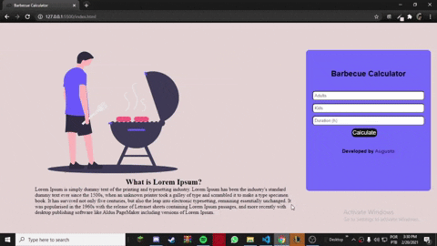
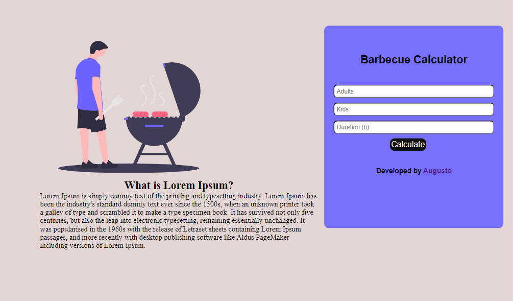
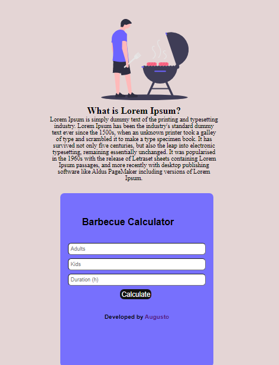

# About (Barbecue-Calculator)📝
Hi,this is a basic JavaScript Challenge, using this you can calculate how many Meats, Beers and Sodas you need to take for a delicious Barbecue 🤤.I hope you enjoy!
That was my fist JavaScript project and you can calculate the values for your Barbecue.

# Data 💾

I used this values to calculate the avarage.

1. Meat = 400gr per person / more than 6 hours = 650
2. Beer = 120ml per person / more than 6 hours = 200ml
3. Soda/Water = 1000ml per person / more than 6 hours = 1500ml

# Functional example ⚙️

# Preview Desktop 🖥️

# Preview Mobile 📱

